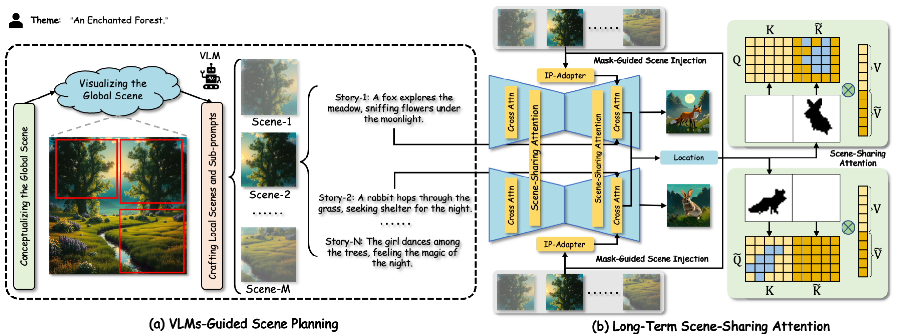

<div align="center">
<h1>
SceneDecorator: Towards Scene-Oriented Story Generation with Scene Planning and Scene Consistency [Official Code of PyTorch]
</h1>


<!-- <p align="center">
    <span>
        <a href="" target="_blank"> 
        </a> &emsp;  &emsp; 
    </span>
    <span> 
        <a href='' target="_blank">
        </a>  &emsp;  &emsp;
    </span>
    <span> 
        <a href='' target="_blank"> 
        </a> &emsp;  &emsp;
    </span>
</p> -->


</div>


## 🎬 Overview
In this work, we design a training-free framework called <b>SceneDecorator</b>, to address two key challenges in story generation: <i>scene planning</i> and <i>scene consistency</i>. SceneDecorator comprises two core techniques: (i) <i>VLM-Guided Scene Planning.</i> Leveraging a powerful Vision-Language Model (VLM) as a director, it decomposes user-provided themes into local scenes and story sub-prompts in a ''global-to-local'' manner. (ii) <i>Long-Term Scene-Sharing Attention.</i> By simultaneously integrating mask-guided scene injection, scene-sharing attention, and extrapolable noise blending, it maintains subject style diversity and long-term scene consistency in story generation.
Overall framework is shown below:


## 🔧 Environment
```
git clone https://github.com/lulupig12138/SceneDecorator.git
# Installation with the requirement.txt
conda create -n SceneDecorator python=3.10
conda activate SceneDecorator
pip install -r requirements.txt
# Or installation with environment.yaml
conda env create -f environment.yml
```

## 🚀 Start
```
bash start.sh
```


## 🎓 Bibtex
🤗 If you find this code helpful for your research, please cite:
```
XXX
```